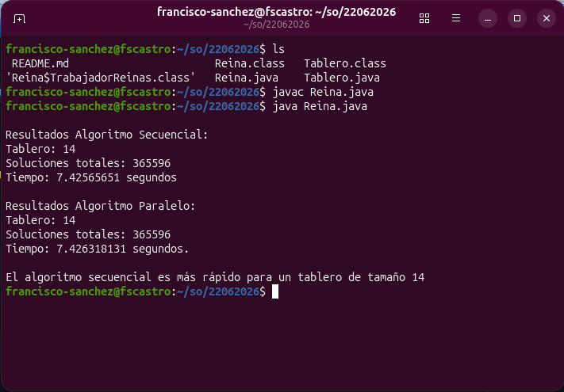

# Solución al Problema de las N-Reinas (Secuencial y Paralelo)

Este repositorio contiene una implementación en **Java** para resolver el clásico problema de las **N-Reinas** utilizando el algoritmo de exploración iterativo con **Backtracking**. El proyecto incluye dos enfoques de ejecución para comparar el rendimiento y el impacto del cómputo concurrente:
1. **Ejecución Secuencial**: Resuelve el problema utilizando una única pila de estados (`LinkedList`).
2. **Ejecución Paralela**: Divide el espacio de búsqueda entre múltiples hilos de ejecución (`Runnable`), distribuyendo cíclicamente las columnas de la primera fila del tablero según el número de procesadores disponibles.

## Características

- **Algoritmo Iterativo:** Utiliza una estructura de datos `LinkedList` simulando una pila para evitar el desbordamiento de memoria por recursión profunda.
- **Concurrencia Inteligente:** Detecta automáticamente el número de núcleos disponibles mediante `Runtime.getRuntime().availableProcessors()` y adapta el número de hilos.

## Estructura del Código

El archivo principal `Reina.java` se compone de:
- `Reina`: Clase base que orquesta la ejecución secuencial, manteniendo una lista de estados (`Tablero`).
- `TrabajadorReinas`: Clase estática interna que implementa `Runnable` para posibilitar el procesamiento multitarea de subárboles de decisión independientes.
- `esComida(int col, Tablero t)`: Función de poda que verifica restricciones horizontales y diagonales para determinar si una posición es segura para la reina.
- `main(String[] args)`: Punto de entrada que ejecuta, mide y compara ambos paradigmas.

*(Nota: Este código requiere de una clase complementaria llamada `Tablero` que gestione las dimensiones `Tablero.TAM`, el renglón actual y el arreglo de posiciones).*

## Requisitos

- **Java Development Kit (JDK):** Versión 8 o superior.
- La clase complementaria **`Tablero.java`** compilada dentro del mismo paquete/directorio.

## Ejecución

Para compilar y ejecutar el programa desde la terminal, sitúate en el directorio raíz de los archivos fuente y ejecuta:
- Compilar los archivos Java
```bash
javac Tablero.java Reina.java
```
- Ejecutar la clase principal
```bash
java Reina
```

## Evidencia de ejecución


